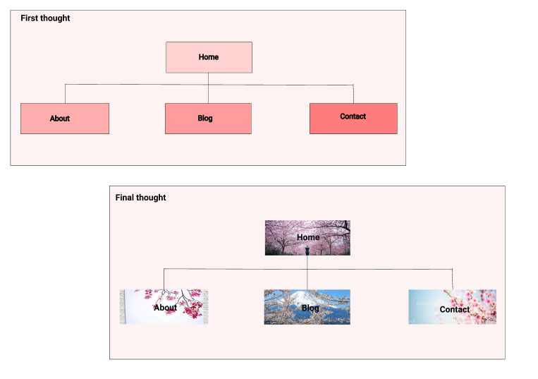
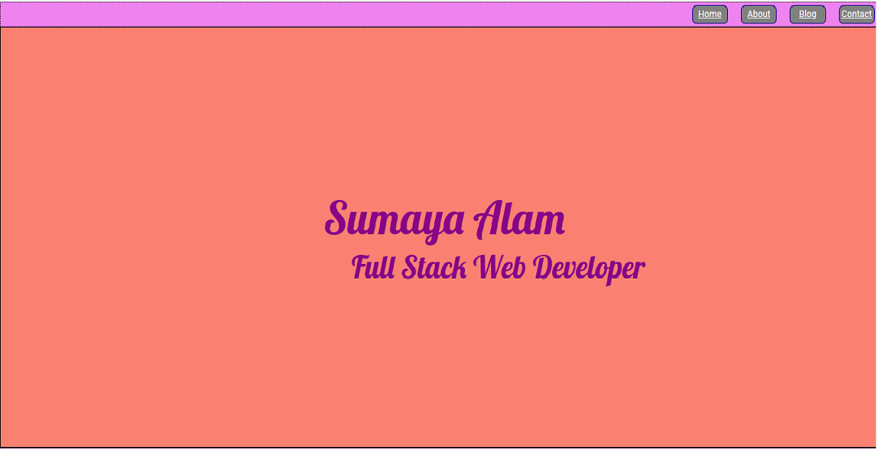
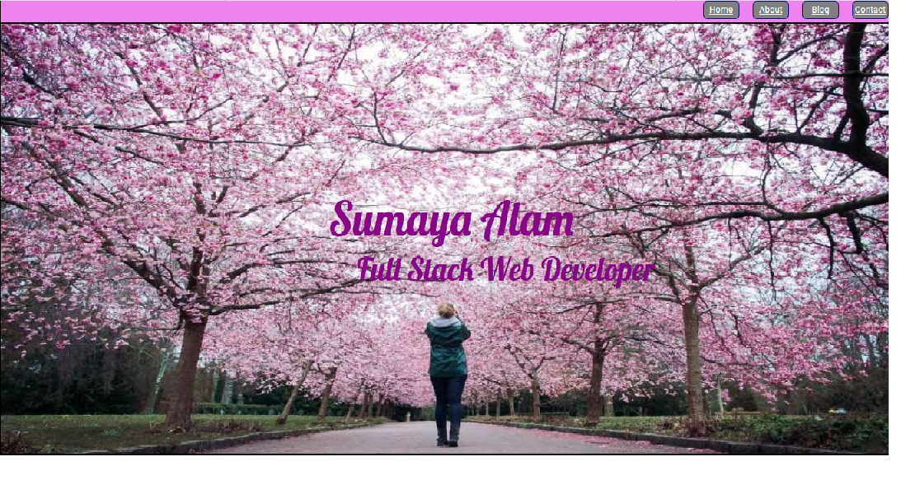
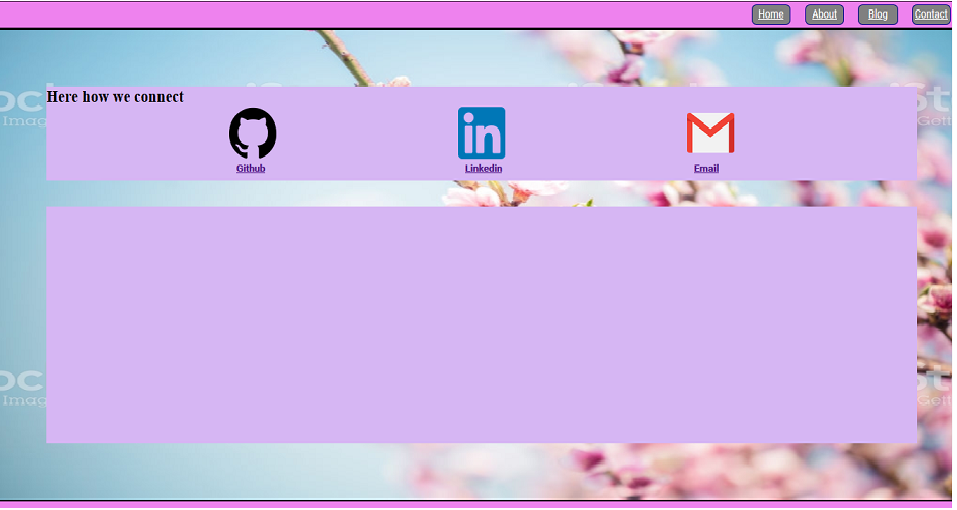
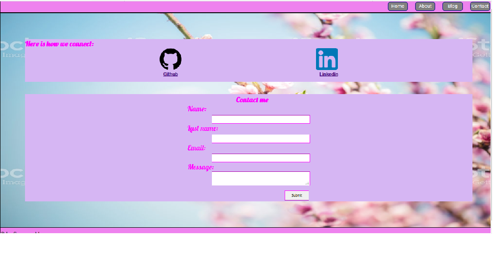

## I have designed the portfolio at 67%. so please zoom it in 67% while you look into it.

### The link (URL) to my published portfolio website is as below:
[Portfolio]https://modest-booth-196b72.netlify.com/)

### The link to my GitHub repository (repo) is as below:
[GitHub](https://github.com/SumayaAlam19/Personal-Portfolio)

### Description of my portfolio website:
#### Purpose:
The basic purpose is to provide an online portfolio where it provides information about me, my skills, interests, professional knowledge and a showcase of my work.
#### Functionality / features
* In my portfolio website in every page there is a nav bar. In nav bar user will see  Home, About, Blog and Contact buttons to click on them. By clicking on them through nav bar user can navigate to any pages they want to see. 
* In contact page user can click on the link of Github and Linkedin to go to my Github and Linkedin accounts.
* In contact page there is a section where user can contact by giving their name, email address or a message. After putting all the details user can simply click on submit button to be contacted.

#### Sitemap
Here you can see two sitemaps as below:

The first one was my initial thought of the sitemap and the other one is the final one which I decided to move on with.

#### Screenshots
Below here are some screenshots which I have taken during my work of making this portfolio.
* First thought of Home page:

* Second thought of Home page:

* First thought of Contact page:

* Second thought of Contact page:

#### Target audience
For my portfolio website the target audience will be an employer looking to engage a dev and/or IT professional. Expecting the employer to have the knowledge and expectations of technical knowledge relating to information technology, software development/coding, programming languages and development stacks. High expectations of professionalism, collaboration and a positive work ethic.

#### Tech stack
HTML, CSS, Netlify etc.

    

